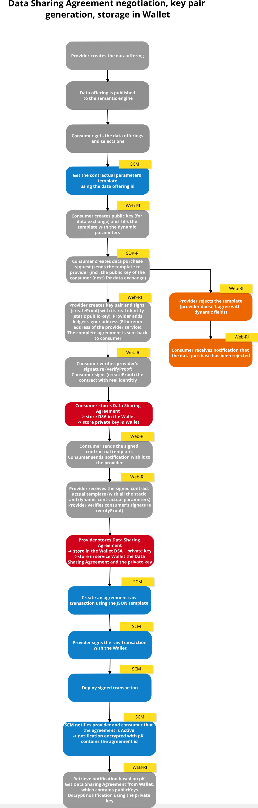
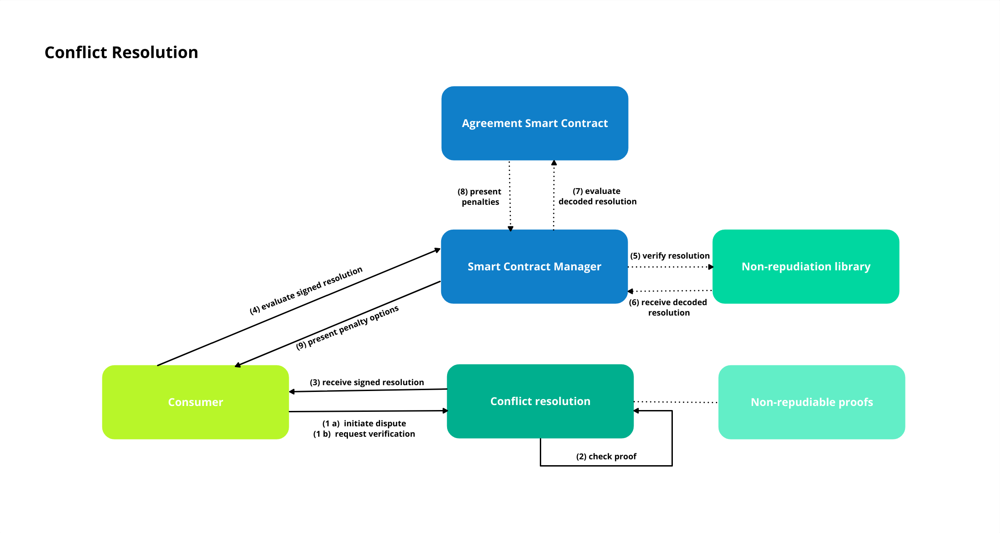

<!---
#  Copyright 2020-2022 i3-MARKET Consortium:
#
#  ATHENS UNIVERSITY OF ECONOMICS AND BUSINESS - RESEARCH CENTER
#  ATOS SPAIN SA
#  EUROPEAN DIGITAL SME ALLIANCE
#  GFT ITALIA SRL
#  GUARDTIME OU
#  HOP UBIQUITOUS SL
#  IBM RESEARCH GMBH
#  IDEMIA FRANCE
#  SIEMENS AKTIENGESELLSCHAFT
#  SIEMENS SRL
#  TELESTO TECHNOLOGIES PLIROFORIKIS KAI EPIKOINONION EPE
#  UNIVERSITAT POLITECNICA DE CATALUNYA
#  UNPARALLEL INNOVATION LDA
#
#  Licensed under the Apache License, Version 2.0 (the "License");
#  you may not use this file except in compliance with the License.
#  You may obtain a copy of the License at
#
#  http://www.apache.org/licenses/LICENSE-2.0
#
#  Unless required by applicable law or agreed to in writing, software
#  distributed under the License is distributed on an "AS IS" BASIS,
#  WITHOUT WARRANTIES OR CONDITIONS OF ANY KIND, either express or implied.
#  See the License for the specific language governing permissions and
#  limitations under the License.
#
-->

# Smart Contract Manager

# 1. Introduction

The Smart Contract Manager (SCM) enforces the contractual agreements between the data provider and the data consumer.

SCM facilitates the creation of agreement objects using the Data Sharing Agreement (DSA) Smart Contract. The DSA Solidity contract is based on a legal agreement for data sharing, considering the existing legal framework (e.g., GDPR). The agreement objects are used to enforce agreed-upon obligations from provider and consumer side. 

The Smart Contracts of the SCM combine legal certainty with automated enforcement and integrated conflict resolution mechanisms. 

The SCM provides a gateway to access the Smart Contracts on Hyperledger Besu. 

SCM relies on other subsystems, such as the semantic engine. It extracts the contractual parameters from the data offering description and returns a template with possible contractual parameters. 

Other subsystems use the SCM to integrate certain functionalities (secure data access, explicit user consent).

SCM uses the Notification Manager to notify the provider or consumer about the changes that occurred to the agreement. For example, whether the agreement has been created, violated or terminated.

<br/>

# 2. Data Sharing Agreement negotiation, key pair generation, storage in Wallet, agreement creation on blockchain 

Before the agreement is stored on the blockchain, the consumer should retrieve the contractual parameters template and fill in the dynamic parameters, such as the consumer did and public key, start date and end date of the agreement. These are filled in when a data purchase request is created. Both parties, the provider and the consumer, should generate their public-private keys (using the non-repudiation library) and they should each sign the contract. After they filled in their public keys and the contract is signed, they should store the generated key pairs and data sharing agreement in their Wallets.

As soon as, the negotiation between the provider and consumer is finished and they agreed on specific contractual parameters, as well as stored the final data sharing agreement and the key pairs in their Wallets, the provider can create the agreement on the blockchain (using the Smart Contract Manager).

Firstly, a raw transaction is created using the data sharing agreement, which was saved in the Wallet. The successful response of creating an agreement request is a raw transaction object. This raw transaction has to be signed using the wallet. After the signed transaction is obtained from the wallet, it has to be deployed. The response should be a transaction object with information about the transaction. If the confirmaton is 1, the transaction was successfully deployed and the agreement was stored on the blockchain.

After this, the provider and consumer receive a notification that the agreement is Active, which means it was created and stored on the blockchain. This notification will be encrypted and contains the agreement id. The notifications should be retrieved from the Notification Manager based on the provider/consumer public key and decrypted using the corresponding private key. After they receive this notification, the provider should POST the data exchange agreement, the agreement id and the private key to data access and then the consumer can start the transfer.
<br></br>



# 2. Run the Smart Contract Manager using the docker image

[Here](https://gitlab.com/i3-market/code/wp3/t3.2/i3m-scm) is the smart contract manager project repository.

+ Clone the repository
+ Install docker engine
+ CD into the directory and run the following command:

```
docker build -t registry.gitlab.com/i3-market/code/wp3/t3.2/i3m-scm:latest .
```

+ To run the image use this command:

```
docker run -p 3333:3333 -e PRIVATE_KEY=smartContractUserPrivateKey -e PRIVATE_ADDRESS=ledgerNodeAddress registry.gitlab.com/i3-market/code/wp3/t3.2/i3m-scm:latest
```

<br/>

# 3. Smart Contract Manager endpoints

## Agreement

+ Retrieve the template with the static contractual parameters:
  
    <mark>GET /template/{offering_id}</mark>

+ Create agreement (raw transaction):
  
    <mark>POST /create_agreement _raw_transaction/{sender_address}</mark>

+ Deploy signed transaction:

    <mark>POST /deploy_signed_transaction<mark>

+ Retrieve the agreement by agreement id:

    <mark>GET /get_agreement/{agreement_id}<mark>

+ Retrieve the agreement's pricing model by agreement id:

    <mark>GET /get_pricing_model/{agreement_id}<mark>

+ Check agreements by consumer public keys:

    <mark>POST /check_agreements_by_consumer <mark>

+ Check agreements by provider public keys:

    <mark>POST /check_agreements_by_provider <mark>

+ Check agreements by data offering:

    <mark>GET /check_agreements_by_data_offering/{offering_id} <mark>

+ Check the agreement state (active - 0, violated - 1, terminated - 2):

    <mark>GET /state/{agreement_id}<mark>

+ Retrieve the active agreement by consumer public key which start date is reached 

    <mark>GET /retrieve_agreements/{consumer_public_key}<mark>

+ Verify signed resolution

    <mark>POST /evaluate signed resolution <mark>

+ Propose penalty

    <mark>POST /propose_penalty <mark>

+ Enforce penalty

    <mark>PUT /enforce_penalty <mark>

+ Terminate agreement

  <mark>PUT /terminate <mark>

## Explicit User Consent

+ Give consent

    <mark>POST /give_consent <mark>

+ Check consent status

    <mark>GET /check_consent_status/{dataOfefringId} <mark>

+ Revoke consent

  <mark>PUT /revoke_consent <mark>

+ Deploy consent signed transaction:

    <mark>POST /deploy_consent_signed_transaction<mark>

<br/>

# 4. Use cases

## Agreement creation

An agreement can be created by a data provider.

In the */create_agreement _raw_transaction/{sender_address}* API the sender address and the JSON template with the contractual parameters (including the dynamic ones) have to be specified.

The sender address is the Ethereum address of the provider which can be found in the wallet.

### Transaction signing and deployment

The successful response of creating an agreement request is a raw transaction object. This raw transaction has to be signed with the wallet. After the signed transaction is obtained from the wallet, it has to be deployed. The deployment endpoint is */deploy_signed_transaction*. The response of the request should be a transaction object with information about the transaction.

### Notification

A notification will be sent from the Smart Contract Manager to the Notification Manager. The provider and consumer will be notified about the changes that occurred to their agreement. If the agreement was successfully created, they will each receive a notification: “Agreement with id: *agreementId* is Active.”
<br/><br/>

## Agreement Violation - Conflict resolution 

After the data transfer is finished, a consumer can request a verification or initiate a dispute using the conflict resolution. The proof of the completeness of the data exchange will be checked and the consumer receives the signed resolution based on that proof.

The Smart Contract Manager evaluates the signed resolution. Within this evaluation, the resolution is decoded and depending on the resolution, the agreement’s state can change from Active to Violated. 

The transfer was unsuccessful when the resolution is:

•	not completed (in case of a verification): the decryption key was not published

•	accepted (in case of a dispute): the cypher block cannot be properly decrypted. 

If the transfer was not successful, the agreement is violated. When the agreement is violated, the consumer receives a list of penalties.

These penalties could be: 

•	New end date for agreement

•	New end date for agreement and a price reduction

•	Terminate agreement

The consumer should propose one of these penalty to the provider. The provider will receive a notification with the chosen penalty and if he agrees to the penalty, he should enforce on the blockchain. By enforcing the new penalty, the agreement state changes from Violated to Active or Terminated (in case the penalty termination is chosen).

